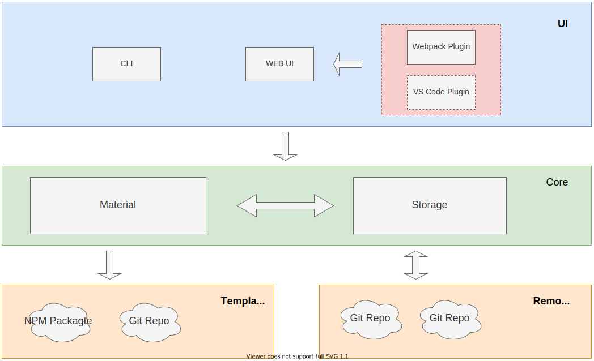

## code-sharer

为共享源码提供的工具。支持自定义模板

### 环境依赖

- nodejs 10.0.0 以上
- git

### 项目结构

- [x] `csm-cli` : 提供终端命令操作
  - [使用文档](./packages/csm-cli/README.md)
- [x] `csm-core` : 实现核心功能模块
  - [使用文档](./packages/csm-core/README.md)
- [x] `csm-ui`: 提供网页界面
  - [使用文档](./packages/csm-ui/README.md)
- [x] `csm-webpack`: Webpack 插件
  - [使用文档](./packages/csm-webpack/README.md)
- [x] `csm-template-vue`: 基于 `vue-cli` 的仓库模板示例
  - [使用文档](./packages/csm-template-vue/README.md)

### 存储库模板与配置

- 配置文件文件`~/.csm.conf`，可通过 CLI 命令 `cms config` 配置

  ```json
  {
    "storage": ["git@github.com:Tone/csm-storage.git"],
    "template": [
      "git@github.com:Tone/code-sharer.git#simple/packages/csm-template-vue"
    ]
  }
  ```

  - `storage`: 物料存储库地址
  - `template`: 初始化存储库的模板，需实现 `init` 方法来执行初始化。支持 git 仓库或者 npm 包，其中 `package.json` 需指定 `csmConfig` 字段。

    - `categories` 指定物料分类及创建模板，需实现 `init` 方法来执行初始化。支持 git 仓库，npm 包及存储库模板文件路径

  ```json
  {
    "csmConfig": {
      "categories": {
        "component": "./component"
      },
      "templateUrl": "git@github.com:Tone/code-sharer.git#simple/packages/csm-template-vue"
    }
  }
  ```

### 物料信息及配置

物料`package.json`示例：

```json
{
  "name": "sd",
  "version": "0.1.0",
  "description": "",
  "keywords": [],
  "files": ["src/**/*", "!src/main.js"],
  "dependencies": {
    "core-js": "^3.6.5",
    "vue": "^2.6.11"
  },
  "csmConfig": {
    "category": "component"
  }
}
```

- `name`: 物料名称
- `keywords`: 物料标签
- `description`: 物料描述
- `files`: 物料包含的文件，将被下载到使用方工程
- `dependencies`: 物料依赖
- `category`: 物料分类

### 结构图



### 流程图


