## code-share-manager

### 项目结构

- `csm-cli` : 提供终端命令操作
- `csm-core` : 实现功能列表

### 项目约束

项目采用`toml`配置文件进行约束，分为：

- 仓库配置约束
  - 仓库支持的项目类型
  - 依赖的执行环境
  - 依赖的包文件
  - 支持的物料分类
    - 物料载入的项目位置
    - 物料包含的文件路径
- 物料配置约束：
  - 约束物料是否符合仓库配置
  - 约束物料的使用依赖

具体配置项见 [约束](#约束)

### 功能列表

##### 检查

检查物料是否符合约束

- 发布更新
- 下载使用

##### 初始化

- 仓库配置
- 物料配置

##### 配置

查看和修改仓库及物料配置文件

##### 发布

提交物料至仓库

##### 查找

查找符合项目的物料

##### 更新

更新已有物料

##### 载入

下载物料源码至工程

### 流程图



### 约束

##### 仓库约束

```toml
#############
## 仓库约束 ##
#############
## 仓库类型
repository = "vue"
## 物料文件夹命名风格 默认 name@author[hash]
style = ""
## 包管理器执行程序 env 位置 -1 为无包管理器
manager = -1

## 执行环境依赖
[[env]]
exec = "node"
version = "^10.0.0"

[[env]]
exec = "npm"
version = "^4.7.0"

## 包依赖
[[package]]
name = "vue"
version = "^2.6.10"

[[package]]
name = "ant-design-vue"
version = "^1.4.12"

## 物料类别
### 组件
[category.component]
position = "" # 组件载入位置
dir = [] # 组件目录约定
inject = false # 是否生成默认的插入片段文件

[category.component.checklist] # 生成组件配置文件时的检查项
name = false # 组件名称 默认文件夹名称
description = true # 组件描述 必须输入
author = false # 组件作者 默认 Git 用户信息 <name email>
tags = false # 组件标签
inject = false # 插入片段

### 区块
[category.block]
position = "" # 区块载入位置
dir = [] # 区块目录约定

### 页面
[category.page]
position = "" # 页面载入位置
dir = [] # 页面目录约定

### 工程
[category.project]
position = "" # 工程载入位置
dir = [] # 工程目录约定

```

##### 物料约束

```toml
#############
## 物料约束 ##
#############
# 所属仓库
repository = "vue"
# 物料类别
category = "component"
# 组件名称 默认文件夹名称
name = ""
# 组件描述 必须输入
description = ""
# 组件作者 默认 Git 用户信息 <name email>
author = ""
# 组件标签
tags = []
# 插入片段"
inject = ""

# 包依赖
[[package]]
name = "vue"
version = "^2.6.10"

[[package]]
name = "ant-design-vue"
version = "^1.4.12"

# 变量依赖
[[var]]
type = "less"
name = ""
path = "style/theme.less"

[[var]]
type = "js"
name = "api"
path = "api/index.js"

```
